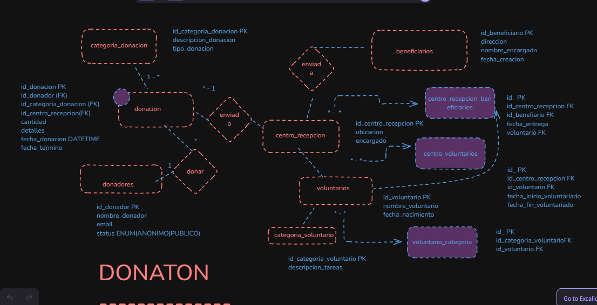
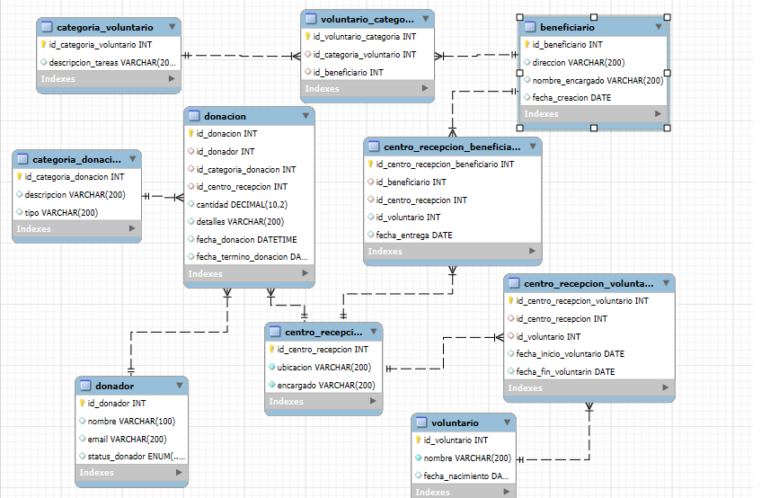

## Primer Der Ontologico de centro de donaciones

## DER WORKBENCH

# Documentación Base de Datos: Donaton

## Descripción del Proyecto
La base de datos **Donaton** está diseñada para gestionar un sistema de donaciones, voluntarios, centros de recepción y beneficiarios, facilitando el seguimiento y organización de las donaciones y del personal voluntario que asiste en las entregas. Esta estructura permite almacenar información esencial de cada entidad, estableciendo relaciones entre ellas para gestionar el flujo de donaciones y servicios de apoyo a beneficiarios específicos.

---

## Tablas y Relaciones

### 1. Tabla `donacion`
Guarda los registros de las donaciones realizadas, con información de la cantidad donada, detalles, y fechas importantes.

- **Campos:**
  - `id_donacion` (INT, PK, AUTO_INCREMENT)
  - `id_donador` (INT, FK `donador`)
  - `id_categoria_donacion` (INT, FK `categoria_donacion`)
  - `id_centro_recepcion` (INT, FK `centro_recepcion`)
  - `cantidad` (DECIMAL, 10,2)
  - `detalles` (VARCHAR, 200)
  - `fecha_donacion` (DATETIME, DEFAULT CURRENT_TIMESTAMP)
  - `fecha_termino_donacion` (DATE)

### 2. Tabla `donador`
Almacena la información de los donadores, incluyendo si prefieren hacer su donación de forma anónima o pública.

- **Campos:**
  - `id_donador` (INT, PK, AUTO_INCREMENT)
  - `nombre` (VARCHAR, 100)
  - `email` (VARCHAR, 200, UNIQUE)
  - `status_donador` (ENUM, 'Anonimo' o 'Publica')

### 3. Tabla `categoria_donacion`
Define las categorías y tipos de donaciones, por ejemplo, ropa, alimentos, dinero, etc.

- **Campos:**
  - `id_categoria_donacion` (INT, PK, AUTO_INCREMENT)
  - `descripcion` (VARCHAR, 200)
  - `tipo` (VARCHAR, 200)

### 4. Tabla `centro_recepcion`
Representa los centros de recepción donde se reciben las donaciones. Cada centro tiene un encargado y una ubicación.

- **Campos:**
  - `id_centro_recepcion` (INT, PK, AUTO_INCREMENT)
  - `ubicacion` (VARCHAR, 200, UNIQUE, NOT NULL)
  - `encargado` (VARCHAR, 200, NOT NULL)

### 5. Tabla `voluntario`
Contiene los datos de los voluntarios, incluyendo su nombre y fecha de nacimiento.

- **Campos:**
  - `id_voluntario` (INT, PK, AUTO_INCREMENT)
  - `nombre` (VARCHAR, 200, NOT NULL)
  - `fecha_nacimiento` (DATE)

### 6. Tabla `categoria_voluntario`
Define las categorías y tareas asignadas a los voluntarios.

- **Campos:**
  - `id_categoria_voluntario` (INT, PK, AUTO_INCREMENT)
  - `descripcion_tareas` (VARCHAR, 200)

### 7. Tabla `beneficiario`
Almacena la información de los beneficiarios, como la dirección, nombre del encargado y fecha de creación.

- **Campos:**
  - `id_beneficiario` (INT, PK, AUTO_INCREMENT)
  - `direccion` (VARCHAR, 200)
  - `nombre_encargado` (VARCHAR, 200)
  - `fecha_creacion` (DATE)

---

## Tablas Intermedias

### 8. Tabla `centro_recepcion_beneficiario`
Establece la relación entre los centros de recepción y los beneficiarios, registrando las entregas realizadas.

- **Campos:**
  - `id_centro_recepcion_beneficiario` (INT, PK, AUTO_INCREMENT)
  - `id_beneficiario` (INT, FK `beneficiario`)
  - `id_centro_recepcion` (INT, FK `centro_recepcion`)
  - `id_voluntario` (INT, FK `voluntario`)
  - `fecha_entrega` (DATE)

### 9. Tabla `centro_recepcion_voluntario`
Relaciona a los voluntarios con los centros de recepción, incluyendo la fecha de inicio y fin de sus servicios.

- **Campos:**
  - `id_centro_recepcion_voluntario` (INT, PK, AUTO_INCREMENT)
  - `id_centro_recepcion` (INT, FK `centro_recepcion`)
  - `id_voluntario` (INT, FK `voluntario`)
  - `fecha_inicio_voluntario` (DATE)
  - `fecha_fin_voluntarin` (DATE)

### 10. Tabla `voluntario_categoria`
Relaciona a los voluntarios con las categorías, asignando beneficiarios a cada uno.

- **Campos:**
  - `id_voluntario_categoria` (INT, PK, AUTO_INCREMENT)
  - `id_categoria_voluntario` (INT, FK `categoria_voluntario`)
  - `id_beneficiario` (INT, FK `beneficiario`)

---

## Relaciones (FOREIGN KEY)

1. **Donación:**
   - `id_donador` -> `donador(id_donador)`
   - `id_categoria_donacion` -> `categoria_donacion(id_categoria_donacion)`
   - `id_centro_recepcion` -> `centro_recepcion(id_centro_recepcion)`

2. **Centro de Recepción y Beneficiario:**
   - `id_beneficiario` -> `beneficiario(id_beneficiario)`
   - `id_centro_recepcion` -> `centro_recepcion(id_centro_recepcion)`

3. **Centro de Recepción y Voluntario:**
   - `id_centro_recepcion` -> `centro_recepcion(id_centro_recepcion)`
   - `id_voluntario` -> `voluntario(id_voluntario)`

4. **Voluntario y Categoría:**
   - `id_categoria_voluntario` -> `categoria_voluntario(id_categoria_voluntario)`
   - `id_beneficiario` -> `beneficiario(id_beneficiario)`

---

## Problemática que Resuelve
Este modelo permite una organización efectiva de las donaciones y el trabajo voluntario en centros de recepción y beneficiarios específicos. Facilita la asignación de voluntarios a tareas, el control de entregas de donaciones y el seguimiento de beneficiarios, optimizando la gestión de recursos en la organización.

